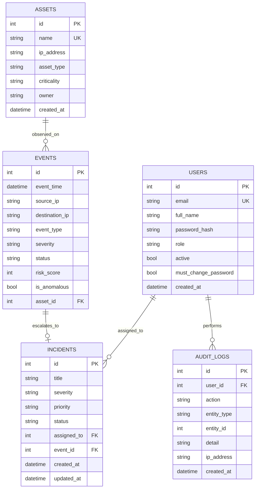

# Data model

```mermaid
erDiagram
    USERS ||--o{ INCIDENTS : assigned_to
    USERS ||--o{ AUDIT_LOGS : performs
    ASSETS ||--o{ EVENTS : observed_on
    EVENTS ||--o| INCIDENTS : escalates_to
    USERS {
        int id PK
        string email UK
        string full_name
        string password_hash
        string role
        bool active
        bool must_change_password
        datetime created_at
    }
    ASSETS {
        int id PK
        string name UK
        string ip_address
        string asset_type
        string criticality
        string owner
        datetime created_at
    }
    EVENTS {
        int id PK
        datetime event_time
        string source_ip
        string destination_ip
        string event_type
        string severity
        string status
        int risk_score
        bool is_anomalous
        int asset_id FK
    }
    INCIDENTS {
        int id PK
        string title
        string severity
        string priority
        string status
        int assigned_to FK
        int event_id FK
        datetime created_at
        datetime updated_at
    }
    AUDIT_LOGS {
        int id PK
        int user_id FK
        string action
        string entity_type
        int entity_id
        string detail
        string ip_address
        datetime created_at
    }
```

`login_attempts` is a supporting security table that stores email/IP/time pairs for short-window login throttling. Password values are never stored in that table.
